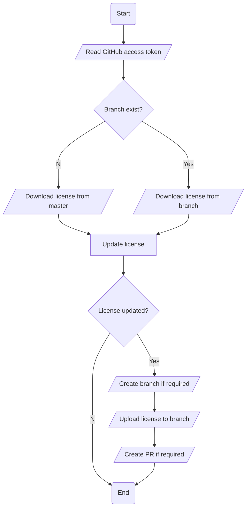

# Action flowchart

The action runs according to the following flowchart.

```mermaid
graph TB
    START(Start)
    END(End)

    %% Input/Output
    IO_READ_GITHUB_ACCESS_TOKEN[/Read GitHub access token/]
    IO_DOWNLOAD_LICENSE_FROM_MASTER[/Download license from master/]
    IO_DOWNLOAD_LICENSE_FROM_BRANCH[/Download license from branch/]
    IO_UPLOAD_LICENSE_TO_BRANCH[/Upload license to branch/]
    IO_CREATE_BRANCH_IF_REQUIRED[/Create branch if required/]
    IO_CREATE_PR_IF_REQUIRED[/Create PR if required/]

    %% Decision
    D_BRANCH_EXISTS{Branch exist?}
    D_LICENSE_UPDATED{License updated?}

    %% Process
    P_UPDATE_LICENSE[Update license]

    %% Workflow definition
    START --> IO_READ_GITHUB_ACCESS_TOKEN --> D_BRANCH_EXISTS
    D_BRANCH_EXISTS --No--> IO_DOWNLOAD_LICENSE_FROM_MASTER --> P_UPDATE_LICENSE
    D_BRANCH_EXISTS --Yes--> IO_DOWNLOAD_LICENSE_FROM_BRANCH --> P_UPDATE_LICENSE
    P_UPDATE_LICENSE --> D_LICENSE_UPDATED
    D_LICENSE_UPDATED --No--> END
    D_LICENSE_UPDATED --Yes--> IO_CREATE_BRANCH_IF_REQUIRED --> IO_UPLOAD_LICENSE_TO_BRANCH --> IO_CREATE_PR_IF_REQUIRED --> END

```
