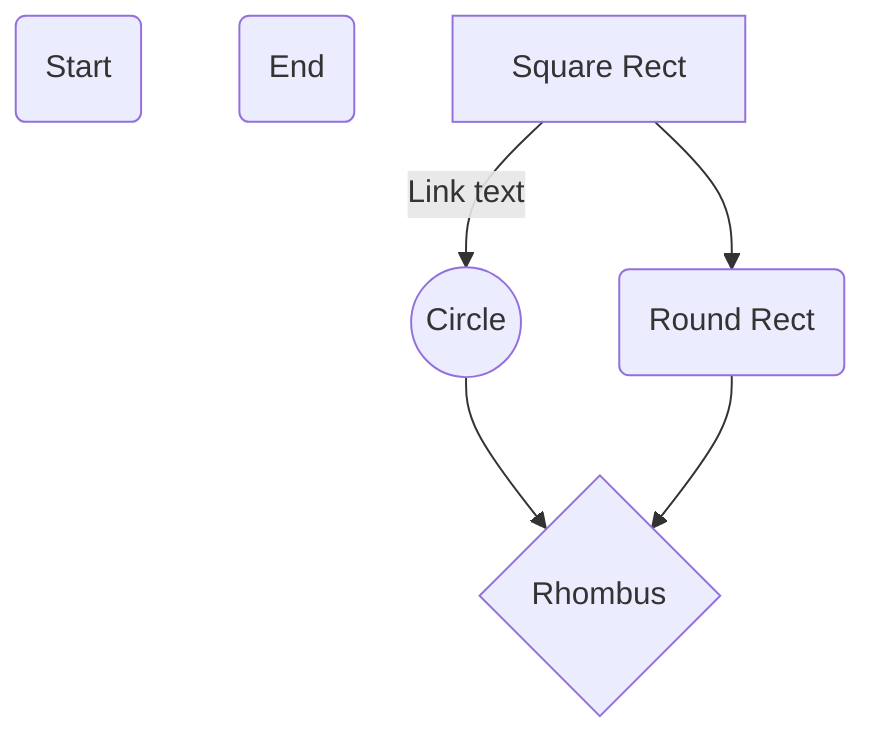

# Action flowchart

The action is implemented according to the following flowchart.

```mermaid
graph TB
    X(Start)
    Y(End)

    A[Square Rect] -- Link text --> B((Circle))
    A --> C(Round Rect)
    B --> D{Rhombus}
    C --> D
```
